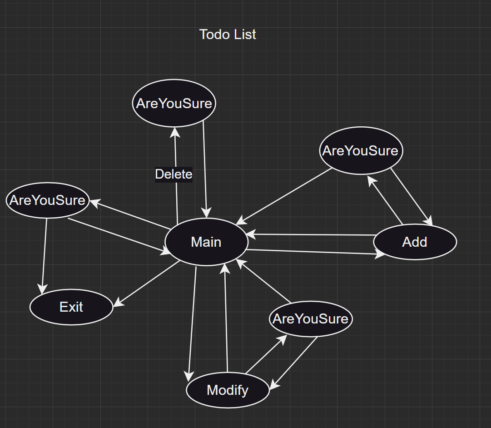

# typed-fsm example: [todoList](https://github.com/sdzx-1/typed-gui/tree/demo/src/Todo) 

The overall structure of todoList is similar to [elm](https://guide.elm-lang.org/architecture/):

Elm programs always look something like this:

The Elm program produces HTML to show on screen, and then the computer sends back messages of what is going on. "They clicked a button!"

What happens within the Elm program though? It always breaks into three parts:

+ Model — the state of your application
+ View — a way to turn your state into HTML
+ Update — a way to update your state based on messages

-------------------------

Compared with elm, todoList introduces control states, which affect Model, View, Update, and Message at the same time.

## Core idea
Let’s take a TodoList:



Each state here represents a page:

Main represents the main page showing the todolist content.

AreYouSure represents the page for selecting Yes or No.

Modify represents the page for modifying a todo.

Add represents the page for adding a todo.

Exit represents exit.

Each arrow represents a message.

You may notice that this looks a lot like fsm. Each state here represents a control flow or a page, and Message changes the control flow or page and may also change the data.
I will use typed-fsm to separate the control state from the all data.


Comparing elm and todoList
| elm     | todoList                            |
| ------- | ----------------------------------- |
| Mode    | Control State: ps , Data State: ds  |
| View    | Sing t -> ds -> UI ps (t :: ps) a   |
| Update  | Op ps ds IO () (to :: ps) (from ps) |
| Message | Msg ps (from :: ps) (to :: ps)      |


The UI part uses the modified [threepenny-gui](https://github.com/sdzx-1/threepenny-gui), the main change is to change the original (UI a) to (UI ps (t::ps) a).

There are at least three advantages to doing this.

1. The type of the View part has a clear control state, which can limit the type of Message and avoid sending error messages.

2. The Update part can give full play to [the advantages of typed-fsm](https://discourse.haskell.org/t/advantages-of-type-fsm/9679), and typed-fsm takes over the entire control flow.

3. Extract the common part and [simplify the control state](https://discourse.haskell.org/t/try-to-combine-typed-fsm-with-gui-to-produce-unexpected-abstract-combinations/10026).

At the same time, typed-fsm supports singletons, and the definition of control state is also very easy:
```haskell
$( singletons
    [d|
      data Todo
        = Main
        | Add
        | Delete
        | Modify
        | Exit
        | Action Todo Todo
        | AreYouSure Todo Todo
        deriving (Show, Eq, Ord)
      |]
 )
```


Control status : cs
Data status    : ds

Op cs ds IO a (to :: cs) (from :: cs)

Result cs (UnexpectMsg cs) (S.StateT ds IO) a

type family RecRenderOutVal (t :: ps)

type RenderSt cs ds =
  forall (t :: cs)
   . Sing t
  -> ds 
  -> Window
  -> Chan (AnyMsg cs)
  -> UI ps t (Maybe (Element, IO (RecRenderOutVal t)))

data InternalRef cs ds = StateRef
  { dataStRef :: IORef ds
  , fsmStRef :: IORef (SomeSing ps)
  , anyMsgTChan :: Chan (AnyMsg ps)
  }

