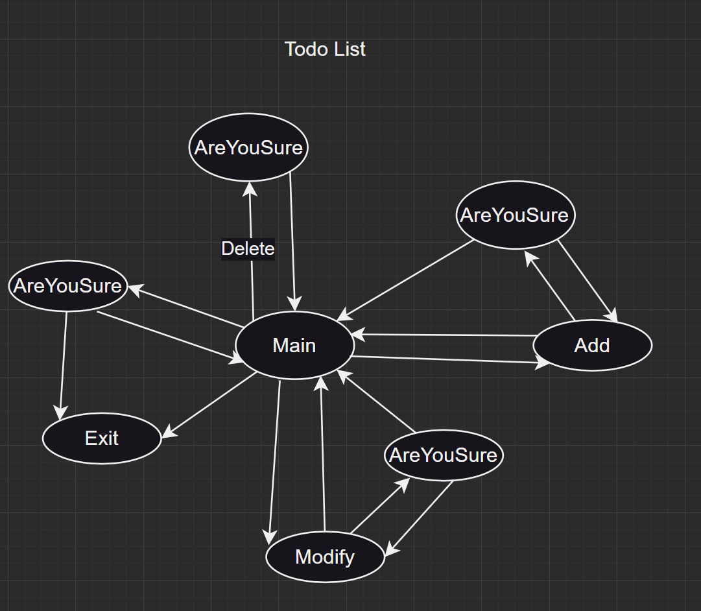
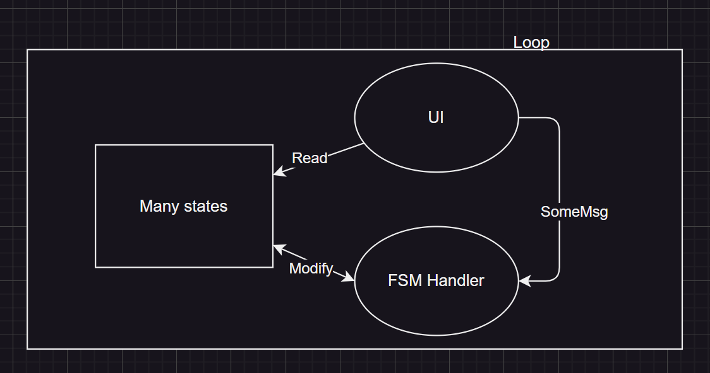
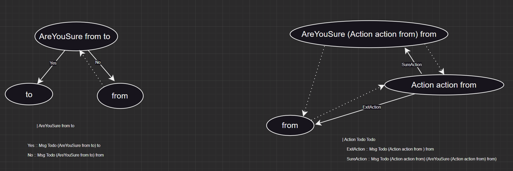

# Try to combine typed-fsm with GUI to produce unexpected abstract combinations

This article requires you to have some understanding of typed-fsm. If you don’t know typed-fsm, you can take a look at the article I wrote about typed-fsm.

# Core idea
Let’s take a TodoList gui project as an example:



Each state here represents a page:

Main represents the main page showing the todolist content

AreYouSure represents the page for selecting Yes or No

Modify represents the page for modifying a todo

Add represents the page for adding a todo

Exit represents exit

Each arrow represents a message

### The overall operating framework is as follows:



The UI first renders the interface to register the event, the FSM Handler waits for the event to be passed in, and then processes the event. This cycle continues.

The overall structure is so simple!

The UI part uses the modified [threepenny-gui](https://github.com/sdzx-1/threepenny-gui), the main change is to change the original (UI a) to (UI ps (t::ps) a). This is done to make the event registered by on contain the current state of the state machine, so that when the UI interface triggers an event, the correct message is sent to the state machine.
```haskell
on :: (element -> Event a) -> element -> (a -> UI ps t void) -> UI ps t ()
on f x = void . onEvent (f x)
```

OK, the core idea has been explained. Next, I will explain the unexpected abstract combination generated in the specific example of todoList
# Unexpected abstract combination

Let's go back to this picture:

It can be found that AreYouSure appears multiple times, and Modify and Add work in the same mode.
So we can extract these two patterns.

Note that the AreYouSure state is even reused in Action.

There is even a generic handler for Action
```haskell
actionHandler'
  :: forall action to
  . (SingI to, SingI action)
  => Op Todo (AllState Todo TodoList) IO (Maybe (ActionOutput action)) to (Action action to)
  actionHandler' =
    getInput I.>>= \case
      SureAction val ->
        getInput I.>>= \case
          Yes -> returnAt (Just val)
          No -> I.do
            liftm $ putSt @action (sing @action) (InternalSt $ Right val)
            actionHandler'
      ExitAction -> returnAt Nothing
```

So our new design is as follows:

This is a huge simplification! ! !

The state machine is defined as follows:
```haskell
$( singletons
[d|
data Todo
= Main
| Add
| Delete
| Modify
| Exit
| Action Todo Todo
| AreYouSure Todo Todo
deriving (Show, Eq, Ord)
|]
)

```

The state transfer message is as follows:
```haskell
instance StateTransMsg Todo where
data Msg Todo form to where
  Yes :: Msg Todo (AreYouSure from to) to
  No :: Msg Todo (AreYouSure from to) from
------------
  ExitAction :: Msg Todo (Action action from) from
  SureAction
    :: ActionOutput action
    -> Msg
      Todo
      (Action action from)
      (AreYouSure (Action action from) from)
  --------------
  EnterAdd
    :: ActionInput Add
    -> Msg Todo Main (Action Add Main)
  EnterModify
    :: ActionInput Modify
    -> Msg Todo Main (Action Modify Main)
  DeleteOne
    :: Int
    -> Msg Todo Main (AreYouSure Main Main)
  -----------------
  IsExitTodo :: Msg Todo Main (AreYouSure Main Exit)
  ExitTodo :: Msg Todo Main Exit
```
# Summary

A simple todoList example seems to make me see the great potential of combining typed-fsm with GUI.


This unexpected combination really surprised me!


Is anyone interested in building a GUI based on this approach?